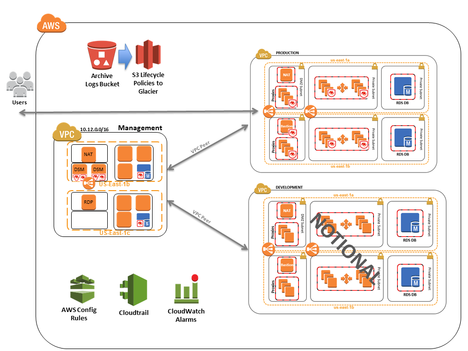
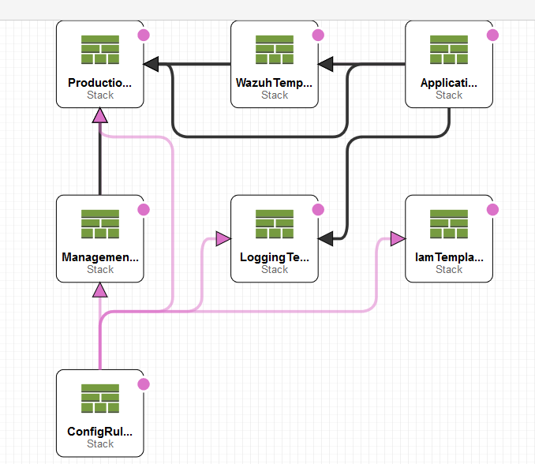

## AWS Cloudformation Security Automation For Wazuh

NIST based Open Source security automation delivered as AWS Cloudformation

This project is based upon the open source security project Wazuh (which itself is a fork of OSSEC) https://github.com/wazuh and a modified version of the AWS NIST High Quickstart https://aws.amazon.com/quickstart/architecture/compliance-nist-high-impact/.

This implementation is intended to show a reference architecture using cloudformation to instantiate an Elastic Stack, Kibana, the Wazuh Manager, and a sample multi-tier application.  This set of templates will take up to 30 minutes to deploy.

What is Wazuh?  https://documentation.wazuh.com/current/installation-guide/index.html

Wazuh provides a security solution capable of monitoring your infrastructure, detecting threats, intrusion attempts, system anomalies, poorly configured applications and unauthorized user actions. It also provides a framework for incident response and regulatory compliance. 
The primary use cases for Wazuh include: Security Analytics, Host Based Intrusion Detection, Log Data Analysis, File Integrity Monitoring, and Incident Response.

Why leverage the AWS NIST High Impact template? https://aws.amazon.com/quickstart/architecture/compliance-nist/
The AWS NIST High Impact components provide security-focused architectural elements for cloud provisioning teams, developers, integrators, and information security teams who need to leverage strict security, compliance, and risk management controls. NIST SP 800-53 (Rev. 4) high-impact security controls baseline

What are we deploying?

Pre-requisites: You will need the ability to deploy up to 7 EIP's. (https://docs.aws.amazon.com/AWSEC2/latest/UserGuide/elastic-ip-addresses-eip.html#eip-basics)  This may require an account increase. https://docs.aws.amazon.com/AWSEC2/latest/UserGuide/ec2-resource-limits.html
We are leveraging cloudformation to deploy a nested stack. https://docs.aws.amazon.com/AWSCloudFormation/latest/UserGuide/using-cfn-nested-stacks.html
The nested stacks allow us to configure and independantly modify resources within the stacks.  This type of automation allows us to replace, extend, or maintain stacks independently.

Main Template -Coordinates the other templates

IAM Template -Give us roles and permissions

Config-Rules Template -Can be extended to include rules important to your business

Logging Template -Sets the logging parameters and the necessary storage locations

VPC-Management -Creates the bastion host and network used to access the environment

VPC-Production -Creates the required VPC, gateways, and networking components for the environment

Application -Deploys a sample application leveraging Linux and Amazon RDS.

Wazuh -Configures the security tools and Wazuh managers.

Acknowledgements:
This project is based on work from two other projects.  The Wazuh project (https://github.com/wazuh) and the AWS NIST High Quickstart (https://aws.amazon.com/quickstart/architecture/compliance-nist-high-impact/).  I would like to thank those who have contributed to those projects and encourage you to review them as well.

## License

This library is licensed under the GPL 2.0 Only.
